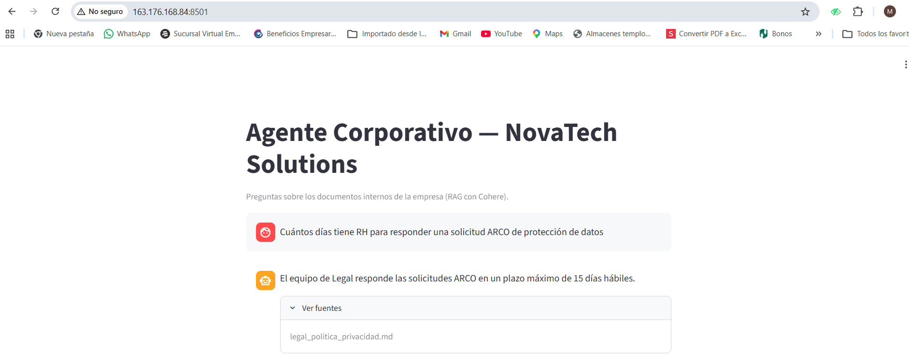
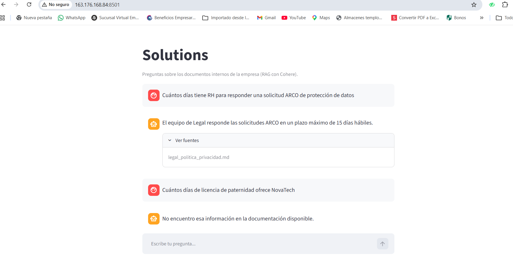

# Agente Corporativo de IA — NovaTech Solutions

Agente de inteligencia artificial (RAG) que responde preguntas de los colaboradores de **NovaTech Solutions** (empresa ficticia, SaaS de gestión de proyectos para pymes de Latinoamérica) con base en documentos internos reales de la organización, cubriendo múltiples formatos y dominios.

> Proyecto desarrollado para el desafío **Alura + Oracle — Agentes de IA**.

## 📌 Estado del proyecto

- [x] Definición del caso de uso y documentos fuente
- [x] Pipeline de ingesta multi-formato
- [x] Pipeline RAG (embeddings + vector store + LLM)
- [x] Interfaz de chat
- [x] Adapter OCI Generative AI implementado y validado (10/10 preguntas, comportamiento equivalente a Cohere)
- [x] Despliegue en Oracle Cloud Infrastructure (OCI) — instancia Compute con Docker, funcionando en http://163.176.168.84:8501
- [x] Evidencia de despliegue (imagen/video)

## 🏢 Contexto: la empresa ficticia

**NovaTech Solutions** es una empresa SaaS (producto: **NovaFlow**, plataforma de gestión de proyectos) con sede en Bogotá y operaciones en México, Perú y Chile, ~140 colaboradores. Los documentos en `docs/` son su base de conocimiento interna.

## 📂 Documentos incluidos (`docs/`)

| Categoría | Documento | Formato |
|---|---|---|
| Recursos Humanos | Manual de onboarding y beneficios | `.docx` |
| Financiero y Contable | Estado de resultados 2025 + presupuesto 2026 | `.xlsx` |
| Operacional | Manual de procedimientos (incidentes, SLA, despliegues, soporte) | `.pdf` |
| Estratégico | Roadmap 2026 y OKRs | `.pptx` |
| Legal y Compliance | Política de privacidad y protección de datos | `.md` |
| Marketing y Comercial | Tabla de precios y planes | `.csv` |
| Datos y Sistemas | Documentación de la API interna de NovaFlow | `.json` |
| Investigación y Desarrollo | Estudio de mercado para expansión regional | `.pdf` |
| Comunicación Interna | Newsletter interno | `.html` |

## 🏗️ Arquitectura

```
Documentos (pdf/docx/xlsx/pptx/md/csv/json/html)
        │
   Ingesta y parsing (loader específico por formato)
        │
   Chunking de texto
        │
   Embeddings + LLM — Cohere (proveedor activo) — con adapter OCIGenAIProvider listo para swap sin cambios en el resto del pipeline (ver src/embeddings/oci_provider.py)
        │
   Vector Store — FAISS / ChromaDB
        │
   Retriever + generación de respuesta (RAG)
        │
   Interfaz de chat — Streamlit
        │
   Despliegue — OCI Compute (Always Free / Container Instances)
```

**Notas técnicas:**
- `VECTORSTORE_PATH` (definido en `.env`) siempre se resuelve contra la raíz del proyecto, no contra el directorio de trabajo del proceso que lo lanza (ver `src/vectorstore/faiss_store.py`). Importante para quien despliegue esto después (incluida la Fase 6 en Docker): si el proceso arranca desde un `cwd` distinto a la raíz del repo, la ruta relativa por defecto (`./data/vectorstore`) igual se resuelve bien.
- El modelo de embeddings correcto para OCI Generative AI es `cohere.embed-v4.0`, no `cohere.embed-multilingual-v3.0` (deprecado, retiro 2026-09-30).
- En las llamadas de chat de OCI (`ChatDetails` / `CohereChatRequest`) hay que fijar `max_tokens` explícitamente: el default de OCI es mucho más bajo que el de Cohere directo y trunca la respuesta a mitad de frase sin avisar (`finish_reason: MAX_TOKENS`).

## 🧪 Ejemplos de preguntas y respuestas

Evidencia real de `tests/test_rag_preguntas_reales.py` (10/10 preguntas, ejecutadas contra el índice FAISS real de `docs/` y Cohere en vivo — no son ejemplos escritos a mano). Cubren las 9 categorías de documentos con distintos niveles de dificultad: preguntas directas, preguntas que combinan dos datos del mismo documento, una con fraseo coloquial (no calcado del texto fuente), una pregunta trampa y una fuera de dominio.

| Pregunta | Respuesta | Fuente citada |
|---|---|---|
| ¿Cuánto tiempo tiene el equipo de Legal para responder una solicitud de derechos ARCO? | 15 días hábiles. | `legal_politica_privacidad.md` |
| ¿Cuál es el tiempo de respuesta objetivo cuando hay un incidente SEV-1? | 15 minutos. | `operacional_manual_procedimientos.pdf` |
| ¿Cuántas solicitudes por hora puede hacer un cliente del plan Business según la API interna de NovaFlow? | Hasta 5000 solicitudes/hora. | `datos_api_interna.json` |
| ¿Cuántos clientes empresariales nuevos se sumaron en el segundo trimestre según el boletín interno de junio? | 142 nuevos clientes empresariales. | `comunicacion_newsletter_junio2026.html` |
| Si soy colaborador remoto y llevo 3 años en la empresa, ¿qué beneficios adicionales tengo por mi modalidad de trabajo y por mi antigüedad? *(combina 2 datos)* | Auxilio de conectividad de USD 30 mensuales (por ser remoto) + una semana adicional de vacaciones por antigüedad ≥ 2 años (semana de descanso flexible). | `rh_manual_onboarding.docx` |
| ¿Cuál fue la utilidad operativa (EBIT) total del año 2025 y en qué mes pasó a ser positiva por primera vez? *(combina 2 datos)* | EBIT total 2025: 30 (miles USD). Pasó a ser positiva por primera vez en junio, con un valor de 3. | `financiero_estado_resultados.xlsx` |
| Según los OKRs de Q3 2026, ¿a cuántos clientes activos quiere llegar NovaTech y a qué porcentaje de churn mensual apunta ese mismo trimestre? *(combina 2 datos)* | 4,200 clientes activos; reducir el churn mensual promedio de 3.2% a 2.6%. | `estrategico_roadmap_2026.pptx` |
| Necesito un plan con soporte prioritario por chat y correo, 250 GB de almacenamiento y proyectos ilimitados. ¿Cuánto me costaría al mes? *(fraseo coloquial, no literal del documento)* | El plan Business cumple esos requisitos, con un precio mensual de USD 29. | `marketing_tabla_precios.csv` |
| **[Pregunta trampa]** ¿Cuántos días de licencia de paternidad ofrece NovaTech Solutions a los nuevos padres? | *"No encuentro esa información en la documentación disponible."* | — (ninguna) |
| **[Fuera de dominio]** ¿Cuál es la capital de Francia? | *"No encuentro esa información en la documentación disponible."* | — (ninguna) |

Las dos últimas preguntas están incluidas **a propósito**: la de licencia de paternidad es un tema plausible que un colaborador real preguntaría pero que no está documentado en el manual de onboarding (prueba que el agente no "extrapola" desde temas relacionados como otros beneficios de RH); la de la capital de Francia es un dato que el modelo conoce de sobra por su entrenamiento general, pero que rechaza igual porque no proviene del CONTEXTO recuperado. En ambos casos el agente responde con el string de rechazo exacto y sin citar ninguna fuente, en vez de inventar una respuesta.

**Diseño anti-alucinación:** las fuentes citadas nunca se generan libremente por el LLM. El modelo debe listar, en una línea `FUENTES_USADAS: ...` al final de su respuesta (separada del texto visible), los nombres de archivo que dice haber usado; `responder()` valida esa lista contra una whitelist con los nombres reales de la metadata de los chunks recuperados por el retriever, y descarta cualquier nombre que el modelo haya inventado o que no estuviera en el contexto entregado. Cuando la información solicitada no aparece en el contexto, el `SYSTEM_PROMPT` obliga a responder con un string de rechazo exacto y fijo, sin fuentes ni relleno — así se distingue una respuesta fundamentada de una alucinación.

## 📁 Estructura del repositorio

```
agente-corporativo-ia/
├── docs/                  # documentos fuente de la empresa ficticia
├── src/
│   ├── ingestion/          # loaders por formato de archivo
│   ├── embeddings/         # cliente de embeddings (OCI Generative AI)
│   ├── vectorstore/        # wrapper de FAISS/Chroma
│   ├── rag/                # retriever + prompt + orquestación
│   └── app/                # interfaz de chat (Streamlit)
├── infra/
│   ├── Dockerfile
│   └── oci/                # scripts de despliegue en OCI
├── tests/
├── requirements.txt
└── .env.example
```

## 🚀 Cómo ejecutar (local)

```bash
python -m venv venv
source venv/bin/activate
pip install -r requirements.txt
cp .env.example .env   # completar credenciales de OCI
streamlit run src/app/main.py
```

## ☁️ Despliegue en Oracle Cloud Infrastructure

Servicio(s) OCI utilizados: **OCI Generative AI** (embeddings + generación) y **OCI Compute** (hospedaje de la aplicación).
Detalles del despliegue en [`infra/oci/README.md`](infra/oci/README.md).

## 🎥 Evidencia de ejecución en la nube

**URL pública:** [http://163.176.168.84:8501](http://163.176.168.84:8501) — instancia Compute (`VM.Standard.E2.1.Micro`, Always Free, `sa-saopaulo-1`) corriendo el contenedor Docker de `infra/Dockerfile`.

> **Nota:** la IP pública de la instancia es efímera y puede cambiar si la VM se reinicia. Las capturas de esta sección documentan el funcionamiento real verificado el 19 de julio de 2026. Si el enlace no responde al momento de revisar este repositorio, el código y los tests locales (ver sección "🧪 Ejemplos de preguntas y respuestas") siguen siendo evidencia funcional completa del agente.

**Pregunta respondida, con fuente citada** — confirma que el retriever y la cita de fuentes funcionan igual que en local:



**Pregunta trampa, rechazada sin alucinar** — confirma que el guardrail anti-alucinación también funciona en el despliegue real, no solo en pruebas locales:



## 🛠️ Stack técnico

- Python 3.11+
- LangChain (orquestación RAG)
- FAISS / ChromaDB (vector store)
- Cohere API (proveedor activo por defecto)
- OCI Generative AI (adapter implementado y validado — ver `src/embeddings/oci_provider.py`)
- Streamlit (interfaz)
- Docker (contenedorización)

## 📄 Licencia

Proyecto educativo desarrollado para el desafío Alura + Oracle. Todos los documentos de la empresa "NovaTech Solutions" son ficticios.
